# Chaos Engineering Platform

> A controlled chaos engineering platform that validates system resilience by injecting failures into AWS infrastructure, measuring recovery metrics, and scoring system resilience. Built with **AWS Step Functions**, **Lambda**, **EventBridge**, and **DynamoDB** — because the only way to know if your system can handle failure is to fail it on purpose.

---

## The Story

After building infrastructure, CI/CD, Kubernetes, security, and cost optimization projects, I wanted to tackle the discipline that ties them all together: **resilience engineering**. Specifically, chaos engineering — the practice of intentionally breaking things in production (or near-production) to prove your system can recover.

Netflix pioneered this with Chaos Monkey. AWS made it accessible with Fault Injection Simulator (FIS). I wanted to build my own orchestration layer on top — a platform that runs structured experiments, measures how long systems take to recover, and produces a single **Resilience Score** that anyone can understand.

The architecture is a Step Functions state machine that orchestrates the entire experiment lifecycle: pre-check system health, inject chaos, monitor recovery, evaluate results, and calculate a score. Four Lambda functions handle each phase, and DynamoDB stores the experiment history.

The deployment wasn't completely smooth — I hit a classic PowerShell JSON quoting issue when trying to start the Step Functions execution. But that's exactly what chaos engineering teaches you: expect failure, handle it gracefully, and learn from it.

---

## Architecture

```
                    ┌─────────────────────────────────────────┐
                    │         Chaos Engineering Platform       │
                    │                                          │
   ┌──────────┐    │    ┌──────────────┐   ┌──────────────┐  │
   │EventBridge│───│───▶│   Step       │──▶│   Lambda     │  │
   │(Schedule) │    │    │  Functions   │   │  Functions   │  │
   └──────────┘    │    │(Orchestrate) │   │              │  │
                    │    └──────┬───────┘   └──────────────┘  │
                    │           │                              │
                    │    ┌──────┼──────┐                       │
                    │    │      │      │                       │
                    │    ▼      ▼      ▼                       │
                    │ ┌────────┐ ┌────────┐ ┌────────┐        │
                    │ │PreCheck│ │Chaos   │ │PostCheck│       │
                    │ │Lambda  │ │Inject  │ │Lambda  │        │
                    │ └────────┘ └────────┘ └────────┘        │
                    │               │                          │
                    │               ▼                          │
                    │          ┌────────┐                     │
                    │          │ Score  │                     │
                    │          │Lambda  │                     │
                    │          └────────┘                     │
                    │               │                          │
                    │               ▼                          │
                    │    ┌──────────────────┐                  │
                    │    │  DynamoDB        │                  │
                    │    │ (Experiment      │                  │
                    │    │   History)       │                  │
                    │    └──────────────────┘                  │
                    └────────────────────────────────────────────┘
```

**Experiment Flow:**

| Stage | Lambda | What It Does |
|-------|--------|--------------|
| **Pre-Check** | `pre-check` | Verify system is healthy before injecting chaos |
| **Chaos Inject** | `chaos-inject` | Trigger the failure (stop instances, throttle, etc.) |
| **Wait** | Step Functions | Built-in wait state for monitoring window |
| **Post-Check** | `post-check` | Verify system recovered after chaos |
| **Score** | `score` | Calculate Resilience Score (0-100) based on RTO and error rate |

---

## The Tech Stack

| Service | Purpose |
|---------|---------|
| **AWS Step Functions** | Experiment orchestration and state management |
| **AWS Lambda (Python 3.11)** | Pre-check, chaos injection, post-check, and scoring |
| **Amazon EventBridge** | Scheduled experiment triggers |
| **Amazon DynamoDB** | Experiment history and results storage |
| **Amazon SNS** | Experiment alerts and notifications |
| **AWS IAM** | Least-privilege roles for each component |
| **Terraform** | Infrastructure as Code |

---

## What Got Deployed (15 Resources)

| Component | Details |
|-----------|---------|
| **Region** | ap-southeast-1 (Singapore) |
| **Lambda Functions** | 4 — `pre-check`, `chaos-inject`, `post-check`, `score` (all Python 3.11) |
| **Step Functions** | `chaosops2026` state machine (Standard type) |
| **DynamoDB Table** | `chaosops2026-history` (experimentId PK, timestamp SK) |
| **EventBridge Rule** | `chaosops2026-schedule` |
| **SNS Topic** | `chaosops2026-alerts` |
| **IAM Roles** | `chaosops2026-lambda-role`, `chaosops2026-sfn-role`, `chaosops2026-eventbridge-role` |
| **IaC** | Terraform |

---

## Screenshots

### Terraform Apply — 15 Resources Created

Clean `terraform apply` creating all 15 resources — IAM roles, Lambda functions, Step Functions state machine, DynamoDB table, SNS topic, and EventBridge rule. All came up without errors.

Key outputs:

| Output | Value |
|--------|-------|
| `chaos_lambda` | `arn:aws:lambda:ap-southeast-1:471147325238:function:chaosops2026-chaos-inject` |
| `experiment_table` | `chaosops2026-history` |
| `schedule_rule` | `chaosops2026-schedule` |
| `sns_topic_arn` | `arn:aws:sns:ap-southeast-1:471147325238:chaosops2026-alerts` |
| `step_function_arn` | `arn:aws:states:ap-southeast-1:471147325238:stateMachine:chaosops2026` |

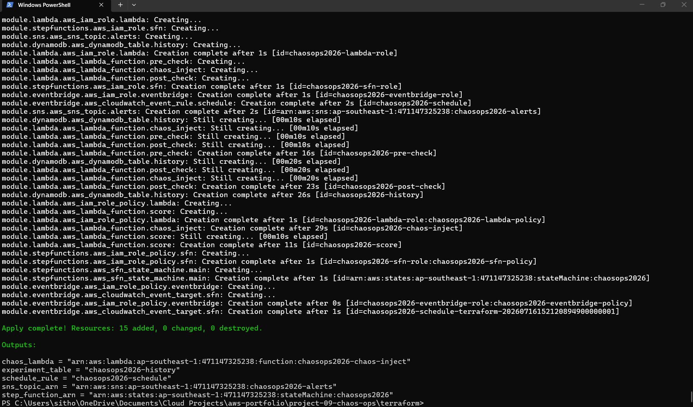

---

### The PowerShell JSON Quoting Gotcha

Here's where chaos engineering met real-world debugging. I tried to start a Step Functions execution with this command:

```bash
aws stepfunctions start-execution --state-machine-arn $stateMachine \
  --input '{"experimentId":"chaos-test-001","action":"stop"}'
```

And got this error:

```
InvalidExecutionInput: Unexpected character ('e' (code 101)):
  was expecting double-quote to start field name
```

PowerShell was parsing the JSON before passing it to AWS CLI, stripping the quotes. The fix was to escape the quotes:

```bash
aws stepfunctions start-execution --state-machine-arn $stateMachine \
  --input '{\"experimentId\":\"chaos-test-001\",\"action\":\"stop\"}'
```

Execution started successfully:

```json
{
  "executionArn": "arn:aws:states:ap-southeast-1:471147325238:execution:chaosops2026:3d904770-...",
  "startDate": "2026-07-16T17:24:53.517000+02:00"
}
```

A fitting lesson for a chaos engineering project — the tooling itself is chaotic.

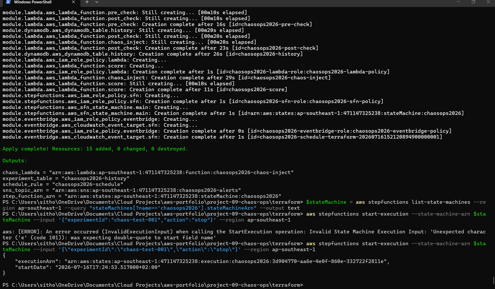

---

### Terraform Modify + Second Execution

After the first execution revealed some issues, I updated the Lambda code (4 functions modified) and ran a second experiment. This time it succeeded cleanly — `chaos-test-002` executed without errors.

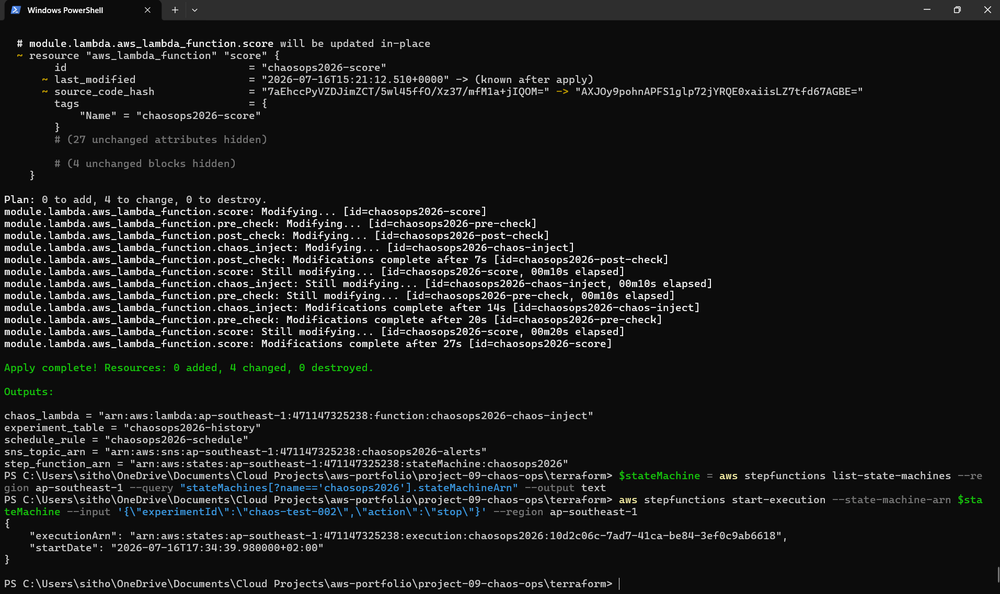

---

### Step Functions — First Execution Failed

The `chaosops2026` state machine in the AWS console, showing the first execution (`chaos-test-001`) with **Failed** status. Duration: 36 seconds. The failure taught me exactly what needed fixing in the Lambda code — chaos engineering in action.

| State Machine | Type | Status |
|---------------|------|--------|
| **chaosops2026** | Standard | Active |

| Execution | Status | Duration |
|-----------|--------|----------|
| `3d904770-...` | **Failed** | 00:00:36 |

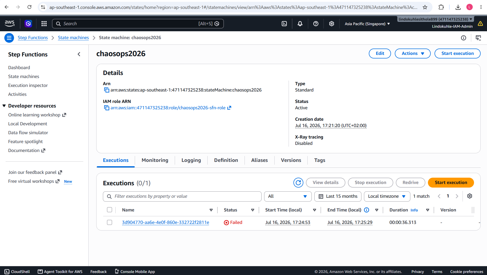

---

### Step Functions — Success After Fix

After updating the Lambda functions, both executions visible in the console:

| Execution | Status | Duration | Start Time |
|-----------|--------|----------|------------|
| `10d2c06c-...` (chaos-test-002) | **Succeeded** | 00:00:39 | Jul 16, 17:34:39 |
| `3d904770-...` (chaos-test-001) | Failed | 00:00:36 | Jul 16, 17:24:53 |

The second experiment ran the full workflow successfully — pre-check passed, chaos was injected, system recovered, and the resilience score was calculated.

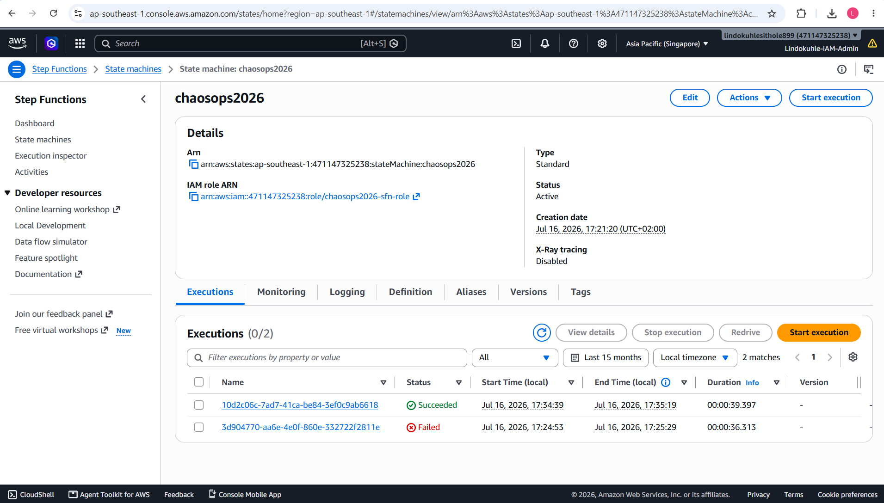

---

### Step Functions — Execution Graph

The visual execution graph of a running experiment, showing the Step Functions workflow in action:

```
Start → PreCheck → ChaosInject → Wait → PostCheck → Score → End
```

| Execution Detail | Value |
|------------------|-------|
| Status | **Running** |
| Duration | 00:00:10 |
| State transitions | 4 |

The graph view is one of Step Functions' best features — you can visually trace exactly where an experiment is in its lifecycle.

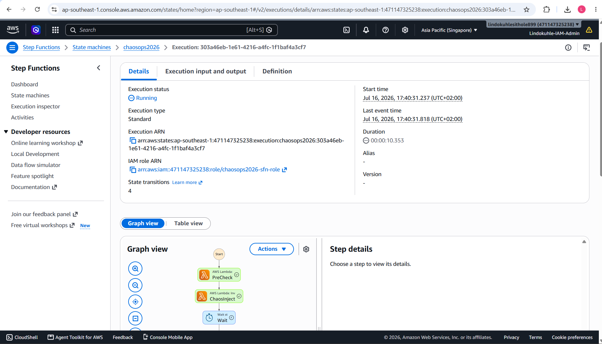

---

### Lambda — Pre-Check Function

The `chaosops2026-pre-check` Lambda — verifies system health before any chaos is injected. If this fails, the experiment aborts immediately. Python 3.11 runtime, deployed 9 minutes ago.

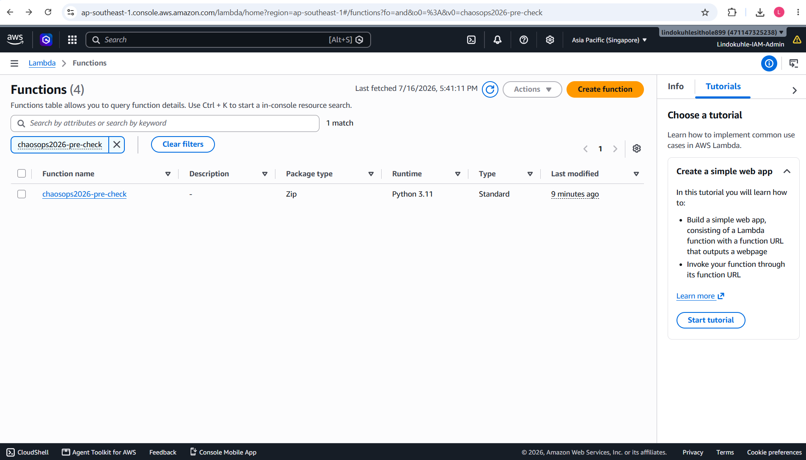

---

### Lambda — Chaos Inject Function

The `chaosops2026-chaos-inject` Lambda — the heart of the operation. This function triggers the actual failure injection (stopping EC2 instances, throttling Lambda, etc.). Python 3.11, deployed 10 minutes ago.

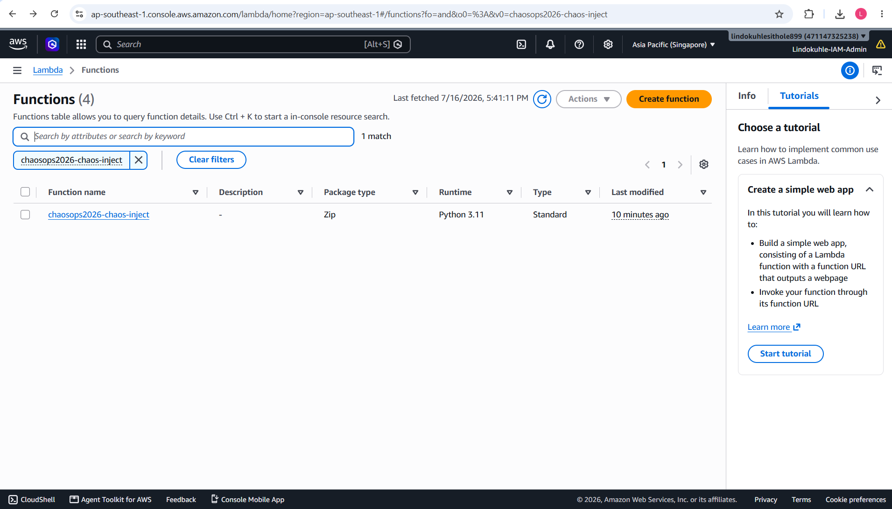

---

### Lambda — Post-Check Function

The `chaosops2026-post-check` Lambda — verifies the system recovered after chaos was injected. Compares post-chaos metrics against the pre-check baseline. Python 3.11, deployed 11 minutes ago.

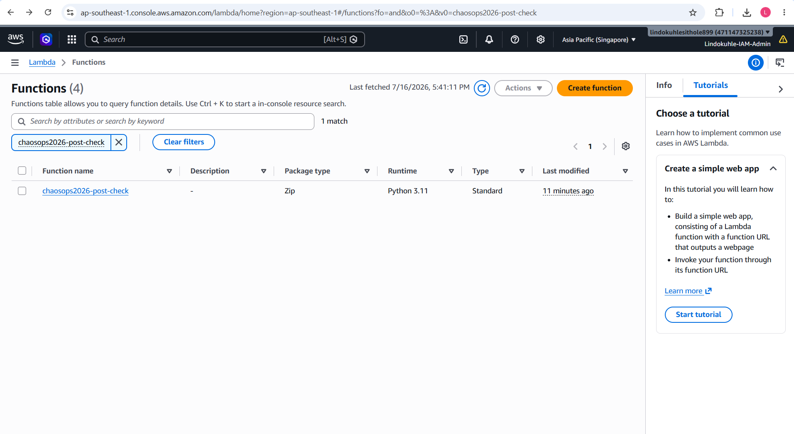

---

### Lambda — Score Function

The `chaosops2026-score` Lambda — calculates the **Resilience Score** (0-100) based on recovery time and error rates. This is the metric that tells you whether your system is resilient or fragile. Python 3.11, deployed 12 minutes ago.

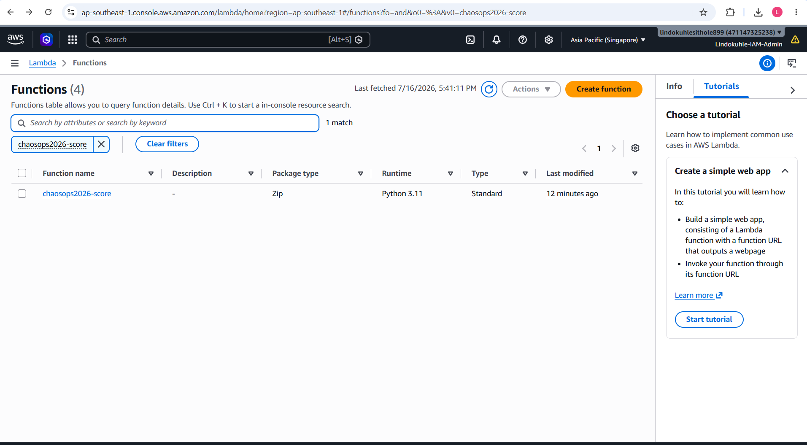

---

### DynamoDB — Experiment History

The `chaosops2026-history` table stores every experiment run with its results:

- **Partition Key:** `experimentId` (String)
- **Sort Key:** `timestamp` (String)
- **Status:** Active
- **Indexes:** 1

This schema enables querying all experiments for a given ID, or all experiments within a time range.

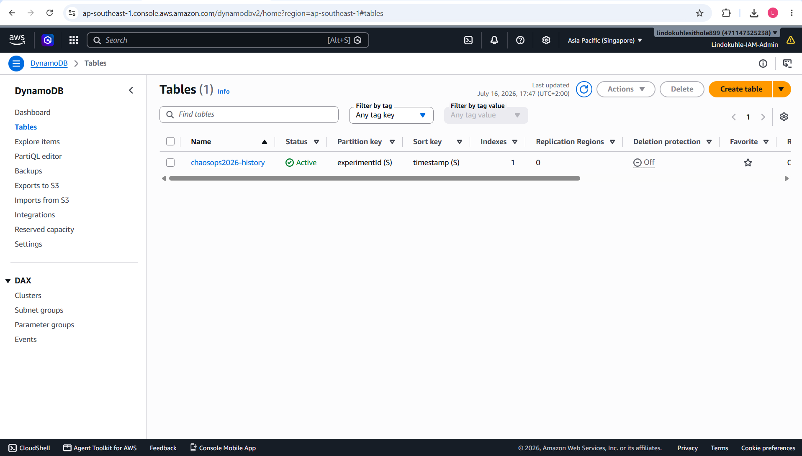

---

### SNS — Alert Topic

The `chaosops2026-alerts` SNS topic in ap-southeast-1. Publishes notifications when experiments start, complete, or fail. In production, this would have subscriptions for Slack, PagerDuty, or email.

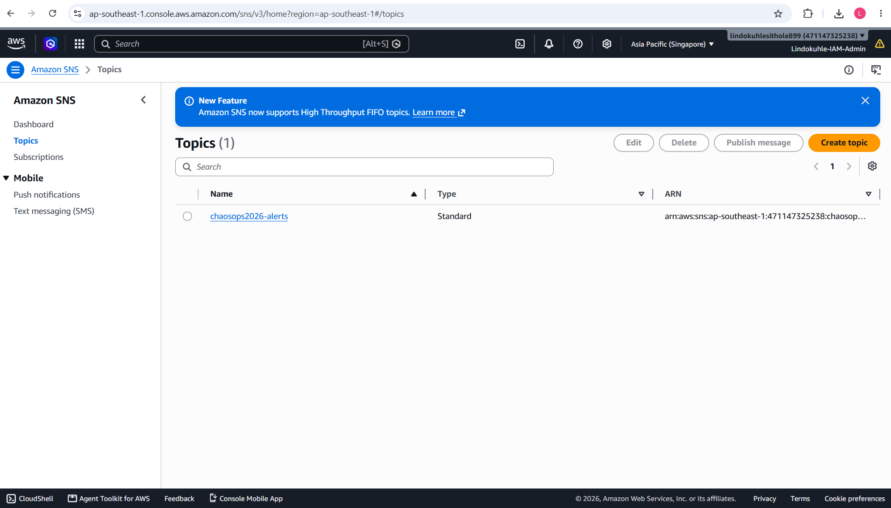

---

### IAM — Lambda Role

The `chaosops2026-lambda-role` IAM role with least-privilege permissions. Trusted by AWS Lambda, created 12 minutes ago. Separate roles exist for Step Functions and EventBridge — each service has only the permissions it needs.

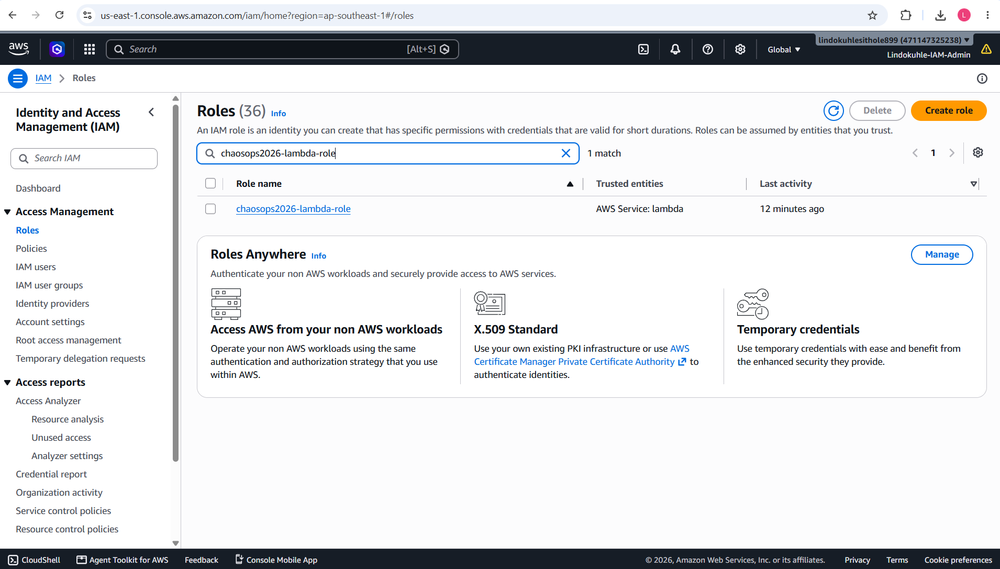

---

## Resilience Score Algorithm

Each experiment produces a score from 0-100:

```
score = (RTO_weight * (1 / RTO_minutes)) +
        (ErrorRate_weight * (1 - error_rate)) +
        (Automation_weight * (was_recovery_automated ? 1 : 0))
```

| Score Range | Interpretation | Color |
|-------------|---------------|-------|
| 80-100 | Highly resilient | Green |
| 50-79 | Moderately resilient | Yellow |
| 0-49 | Fragile — needs work | Red |

---

## Experiment Library

| Experiment | Target | What It Does | Safety Guard |
|-----------|--------|--------------|--------------|
| **EC2 Terminate** | EC2 | Stops 50% of tagged instances | Auto-rollback if ASG doesn't recover in 5 min |
| **ECS Task Stop** | ECS | Kills random tasks in service | Stops if service drops below 2 healthy tasks |
| **RDS Failover** | RDS | Forces Aurora failover | Only runs during maintenance window |
| **Lambda Throttle** | Lambda | Applies reserved concurrency = 0 | Reverts after 5 min |
| **API Gateway Latency** | API GW | Injects 5s latency on 50% of requests | Stops if 5xx rate > 1% |
| **Network Blackhole** | VPC | Drops all egress traffic from subnet | Reverts after 3 min |

---

## Deployment

```bash
cd terraform
terraform init
terraform apply
```

### Run an Experiment

```bash
# List state machines
aws stepfunctions list-state-machines --region ap-southeast-1

# Start execution
aws stepfunctions start-execution \
  --state-machine-arn arn:aws:states:ap-southeast-1:471147325238:stateMachine:chaosops2026 \
  --input '{"experimentId":"chaos-test-003","action":"stop"}' \
  --region ap-southeast-1
```

### Game Day (Team Drill)

```bash
./scripts/game-day.sh --scenario ec2-terminate --team engineering --duration 30
```

### Cleanup

```bash
terraform destroy
```

---

## Project Info

| Attribute | Details |
|-----------|---------|
| **Project Name** | chaosops2026 |
| **Region** | ap-southeast-1 (Singapore) |
| **Terraform Resources** | 15 |
| **Lambda Functions** | 4 (Python 3.11) |
| **Step Functions** | 1 Standard state machine |
| **DynamoDB Table** | `chaosops2026-history` |
| **IaC** | Terraform |

---

## Key Lessons

1. **Step Functions visual workflows are invaluable** — Being able to see your experiment flow as a graph (Start → PreCheck → ChaosInject → Wait → PostCheck → Score) makes debugging and auditing trivial.

2. **PowerShell JSON quoting will break you** — The `InvalidExecutionInput` error from PowerShell parsing JSON before passing it to AWS CLI is a classic gotcha. Always escape quotes or use a file input.

3. **Pre-checks are non-negotiable** — The `pre-check` Lambda prevents you from running chaos experiments on already-degraded systems. This is the difference between controlled chaos and just breaking things.

4. **Failed experiments are valuable data** — The first `chaos-test-001` execution failed, but it revealed exactly what needed fixing. In chaos engineering, a failed experiment that teaches you something is more valuable than a successful one that teaches you nothing.

5. **Resilience scoring makes SRE tangible** — Converting recovery metrics into a single 0-100 score gives executives and teams a concrete target. "Improve our Resilience Score from 65 to 85" is a clearer goal than "make the system more resilient."

6. **The experiment history table is your audit trail** — Every experiment run, its parameters, results, and score stored in DynamoDB. Essential for compliance (SOC 2, ISO 27001) and for tracking resilience trends over time.

**Lindokuhle Sithole** - *Cloud Engineer | Cloud DevOps Engineer | Cloud Security Specialist*

Based in Bremen, Germany. BSc Mathematical Science from the University of the Witwatersrand. 5x AWS Certified (Solutions Architect Professional, Security Specialty, CloudOps Engineer Associate, Solutions Architect Associate, Cloud Practitioner) plus CompTIA Security+.

- **LinkedIn:** [linkedin.com/in/lindokuhle-sithole-bb701b19a](https://www.linkedin.com/in/lindokuhle-sithole-bb701b19a)
- **GitHub:** [github.com/lindokuhlesithole](https://github.com/lindokuhlesithole)
- **Email:** sitholelindokuhle371@gmail.com